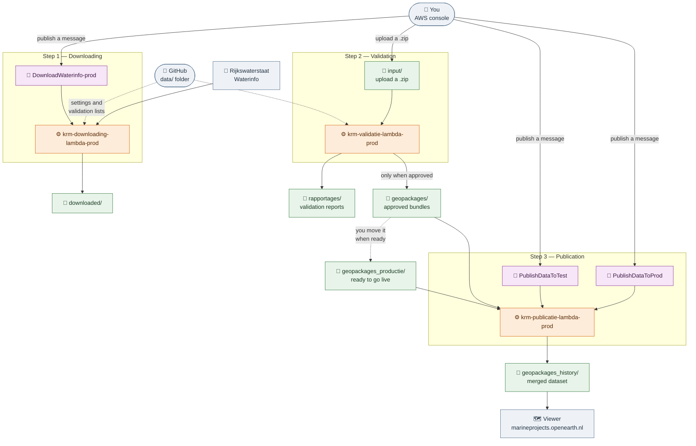

# KRM validatie — user guide

This guide describes how to use the KRM data chain from the **AWS console** and from **GitHub**.
It is written for the people who run the process, not for developers. You do not need to install
anything and you do not need to write code: a browser is enough.

Everything happens in the **Europe (Ireland) / eu-west-1** region. If you do not see what this
guide describes, check the region selector at the top right of the AWS console first.

## The chain in three steps

| Step | What it does | How it starts | Where the result goes |
| --- | --- | --- | --- |
| **1. Downloading** | Fetches measurement data from Rijkswaterstaat Waterinfo | You publish an SNS message | `downloaded/` in the data bucket |
| **2. Validation** | Checks a data bundle against the validation rules | You upload a ZIP file to S3 | `rapportages/` and `geopackages/` |
| **3. Publication** | Merges the approved geopackages and publishes them | You publish an SNS message | `geopackages_history/` and the viewer |

The three steps are independent. Validation does not start automatically after a download, and
publication does not start automatically after a validation. You decide when each step runs.

All data lives in one place: the **`krm-validatie-data-prod`** bucket.



Everything inside the numbered boxes runs by itself. The only things you do are publish a message,
upload a ZIP file, and edit the files in `data/` on GitHub.

---

# Step 1 — Downloading Waterinfo data

Downloads measurement data from Waterinfo and saves it as CSV files in the data bucket.

## Change what gets downloaded

All settings live in one file on GitHub:

**[data/waterinfo_downloading_settings.toml](https://github.com/openearth/krmvalidatie/edit/main/data/waterinfo_downloading_settings.toml)**
← this link opens the file directly in edit mode

1. Click the link, change the values you need and scroll down to **Commit changes**.
2. Write a short description of your change, choose **Commit directly to the `main` branch** and
   confirm.

The change takes effect immediately: the process reads this file from GitHub every time it runs.
Nothing has to be deployed or restarted.

| Setting | Example | What it means |
| --- | --- | --- |
| `grootheid_code` | `"AANTPLTE"` | Which quantity to download. This is the main choice. |
| `start_date` | `"2022-12-31"` | First day of the period, always `YYYY-MM-DD` |
| `end_date` | `"2023-12-31"` | Last day of the period, always `YYYY-MM-DD` |
| `compartiment_code` | `"OR"` | Compartment the measurement belongs to |
| `method_code` | `"other:X156"` | Determines which locations are used. Leave as is unless you know better. |
| `limit_locations` | `0` | `0` is all locations. Use `1` for a quick test run. |
| `s3_prefix` | `"downloaded"` | The folder in the bucket where the result is saved |

Keep the quotation marks around text (`"AANTPLTE"`), leave them off numbers (`0`), and always
write dates as `YYYY-MM-DD`.

## Start the download

**[▶ Publish a message to DownloadWaterinfo-prod](https://eu-west-1.console.aws.amazon.com/sns/v3/home?region=eu-west-1#/publish/topic/arn:aws:sns:eu-west-1:637423531264:DownloadWaterinfo-prod)**

1. Click the link above (or: console → **SNS** → **Topics** → `DownloadWaterinfo-prod` →
   **Publish message**).
2. Leave **Subject** empty, or write something like `Manual download`.
3. In **Message body**, type exactly:

   ```
   {}
   ```

   Those two curly brackets mean *"use the settings from GitHub as they are"*. This is the normal
   case.
4. Click **Publish message**.

The download starts within a few seconds and takes about half a minute for the standard settings.

### Deviating for one run

Instead of `{}` you can put settings in the message itself. Anything you do not mention keeps its
value from GitHub:

```
{"grootheid_code": "WATHTE", "start_date": "2024-01-01", "end_date": "2024-02-01"}
```

Use this for one-off runs only. It is not recorded anywhere, so nobody else can see what was
used. For anything you want to repeat, edit the file on GitHub instead.

## Find the result

**[📁 downloaded/ in the prod bucket](https://eu-west-1.console.aws.amazon.com/s3/buckets/krm-validatie-data-prod?region=eu-west-1&prefix=downloaded/)**

```
downloaded/
└── AANTPLTE/                        the quantity you downloaded
    ├── bergenaanzee.standafvalmeetnet.csv     one file per location
    ├── ...
    └── AANTPLTE_combined.csv                  all locations together
```

The `_combined.csv` is usually the one you want. Tick the checkbox and click **Download**.

> ⚠️ **Every run empties its own folder first.** What you see is always exactly the result of the
> most recent run, never a mixture with an older one. Results are therefore not kept: download
> what you want to keep before starting the next run for the same quantity. Folders of other
> quantities are never touched.

---

# Step 2 — Validating a data bundle

Checks a data bundle against the validation rules and, if it passes, turns it into a geopackage
that can be published.

## Start a validation

Validation has **no message**: it starts automatically as soon as you upload a ZIP file.

**[⬆ Upload to input/ in the prod bucket](https://eu-west-1.console.aws.amazon.com/s3/buckets/krm-validatie-data-prod?region=eu-west-1&prefix=input/)**

1. Click the link above (or: console → **S3** → `krm-validatie-data-prod` → folder `input/`).
2. Click **Upload**, then **Add files**, and select your ZIP file.
3. Click **Upload** at the bottom.

The validation starts by itself. Only files in `input/` ending in **`.zip`** trigger it; anything
else is ignored.

The ZIP contains the CSV file with the data bundle. If an **akkoord** file is included, the bundle
is exported even when it does not pass all checks — that is the way to push through a bundle you
have approved manually.

## Change the validation rules

The rules are three files in the `data/` folder on GitHub. They are read from the `main` branch
each time a validation runs, so committing a change is enough:

| File | What is in it |
| --- | --- |
| **[validatielijst.csv](https://github.com/openearth/krmvalidatie/edit/main/data/validatielijst.csv)** | the validation list: which parameters are expected per location |
| **[groep.csv](https://github.com/openearth/krmvalidatie/edit/main/data/groep.csv)** | the grouping of parameters |
| **[kolomdefinitie.csv](https://github.com/openearth/krmvalidatie/edit/main/data/kolomdefinitie.csv)** | which columns a data bundle must contain and their format |

Editing a CSV in the GitHub web editor works, but for larger changes it is easier to download the
file, edit it in Excel and then upload it over the existing one (**Add file → Upload files** in
the `data/` folder, keeping the same name).

> ⚠️ Save as **CSV**, not as an Excel workbook, and keep the column names unchanged. A renamed or
> missing column makes every validation fail.

## Find the result

**[📁 rapportages/ in the prod bucket](https://eu-west-1.console.aws.amazon.com/s3/buckets/krm-validatie-data-prod?region=eu-west-1&prefix=rapportages/)**

| File | What it is |
| --- | --- |
| `rapportages/<bundle name>.csv` | the validation report: what passed and what failed |
| `rapportages/validatielijst_per_locatie_met_aantal_<bundle name>.csv` | counts per location |
| `rapportages/akkoorddata.csv` | overview of all processed bundles and their status |
| `geopackages/<bundle name>.gpkg` | **only created when the bundle is approved** |

Start with the validation report. If the bundle passed, a geopackage appears in `geopackages/`
and the bundle is ready for step 3. If no geopackage appears, the bundle did not pass and the
report tells you why.

---

# Step 3 — Publishing

Merges all approved geopackages into one dataset and publishes it to the viewer.

There are two variants, and **the topic you publish to determines which one runs**:

| Topic | Uses the folder | Publishes to |
| --- | --- | --- |
| **PublishDataToTest** | `geopackages/` | the test environment |
| **PublishDataToProd** | `geopackages_productie/` | the production environment |

So publishing to test does *not* automatically put the same data live afterwards: the two read
from different folders. Move a geopackage to `geopackages_productie/` when it is ready to go live.

## Publish to test

**[▶ Publish a message to PublishDataToTest](https://eu-west-1.console.aws.amazon.com/sns/v3/home?region=eu-west-1#/publish/topic/arn:aws:sns:eu-west-1:637423531264:PublishDataToTest)**

## Publish to production

**[▶ Publish a message to PublishDataToProd](https://eu-west-1.console.aws.amazon.com/sns/v3/home?region=eu-west-1#/publish/topic/arn:aws:sns:eu-west-1:637423531264:PublishDataToProd)**

In both cases: click the link, leave **Subject** empty and type anything in **Message body** —
for example:

```
start
```

The content of the message is **not** used for publication; only the topic you publish to matters.
The message body may not be empty, so type a word. Then click **Publish message**.

## Two names for the same topic

You will see two topics with almost the same name in the console:

| | |
| --- | --- |
| `PublishDataToTest` | [publish](https://eu-west-1.console.aws.amazon.com/sns/v3/home?region=eu-west-1#/publish/topic/arn:aws:sns:eu-west-1:637423531264:PublishDataToTest) |
| `PublishDataToTest-prod` | [publish](https://eu-west-1.console.aws.amazon.com/sns/v3/home?region=eu-west-1#/publish/topic/arn:aws:sns:eu-west-1:637423531264:PublishDataToTest-prod) |
| `PublishDataToProd` | [publish](https://eu-west-1.console.aws.amazon.com/sns/v3/home?region=eu-west-1#/publish/topic/arn:aws:sns:eu-west-1:637423531264:PublishDataToProd) |
| `PublishDataToProd-prod` | [publish](https://eu-west-1.console.aws.amazon.com/sns/v3/home?region=eu-west-1#/publish/topic/arn:aws:sns:eu-west-1:637423531264:PublishDataToProd-prod) |

**Both work and do exactly the same thing.** The names without a suffix were created by hand
earlier; the ones with `-prod` come from the infrastructure configuration. They point to the same
publication function, which looks at whether the name contains `PublishDataToProd` or
`PublishDataToTest`, not at the suffix.

Publishing to both is not useful: it simply runs the same job twice. Agree within the team which
of the two you use, so the history stays readable.

## Find the result

**[📁 geopackages_history/ in the prod bucket](https://eu-west-1.console.aws.amazon.com/s3/buckets/krm-validatie-data-prod?region=eu-west-1&prefix=geopackages_history/)**

The merged dataset is saved as `geopackages_history/krm_actuele_dataset_new.gpkg`. After that the
publication function passes it on to the viewer at `marineprojects.openearth.nl`. Publication may
take a few minutes, depending on the size of the dataset.

---

# Checking whether something worked

None of the steps report back in the console by themselves. You check the logs:

| Step | Logs |
| --- | --- |
| Downloading | [krm-downloading-lambda-prod](https://eu-west-1.console.aws.amazon.com/cloudwatch/home?region=eu-west-1#logsV2:log-groups/log-group/$252Faws$252Flambda$252Fkrm-downloading-lambda-prod) |
| Validation | [krm-validatie-lambda-prod](https://eu-west-1.console.aws.amazon.com/cloudwatch/home?region=eu-west-1#logsV2:log-groups/log-group/$252Faws$252Flambda$252Fkrm-validatie-lambda-prod) |
| Publication | [krm-publicatie-lambda-prod](https://eu-west-1.console.aws.amazon.com/cloudwatch/home?region=eu-west-1#logsV2:log-groups/log-group/$252Faws$252Flambda$252Fkrm-publicatie-lambda-prod) |

Click the newest **log stream** at the top of the list; that is the most recent run. The lines are
in chronological order and end with a summary.

## Common situations

| What you see | What it usually means | What to do |
| --- | --- | --- |
| No new log stream | The message never arrived, or you are in the wrong region | Check that the region is eu-west-1 and publish again |
| Nothing happens after an upload | The file is not in `input/`, or does not end in `.zip` | Upload it again in the right folder |
| No geopackage after a validation | The bundle did not pass the checks | Read `rapportages/<name>.csv` |
| An error right after reading the settings | A typo in a file in `data/` | Check your last change on GitHub: quotation marks, commas, column names |
| `Task timed out` | Too much data for one run | Split it into smaller pieces, for example a shorter period |

If it still fails, copy the last lines of the log and pass them on to the development team.

---

# Practical points

- **Changes on GitHub apply immediately.** Every run reads the files in `data/` afresh from the
  `main` branch. There is no cache and nothing needs to be deployed.
- **Everything is recorded.** GitHub keeps the history of every change to the settings and the
  validation lists, so you can always see who changed what and go back to an earlier version.
- **Running something twice is harmless**, except for downloading, which overwrites its own
  folder.
- **Publication does not happen by itself.** A validated bundle stays waiting until someone
  publishes a message in step 3.

If something is unclear or does not work as described here, contact the development team.
